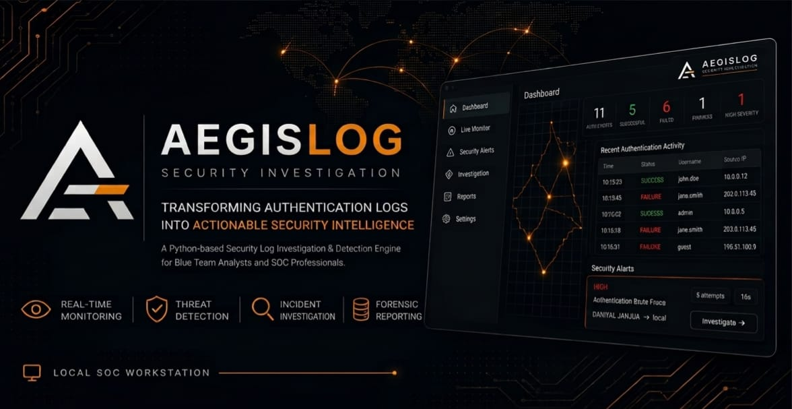
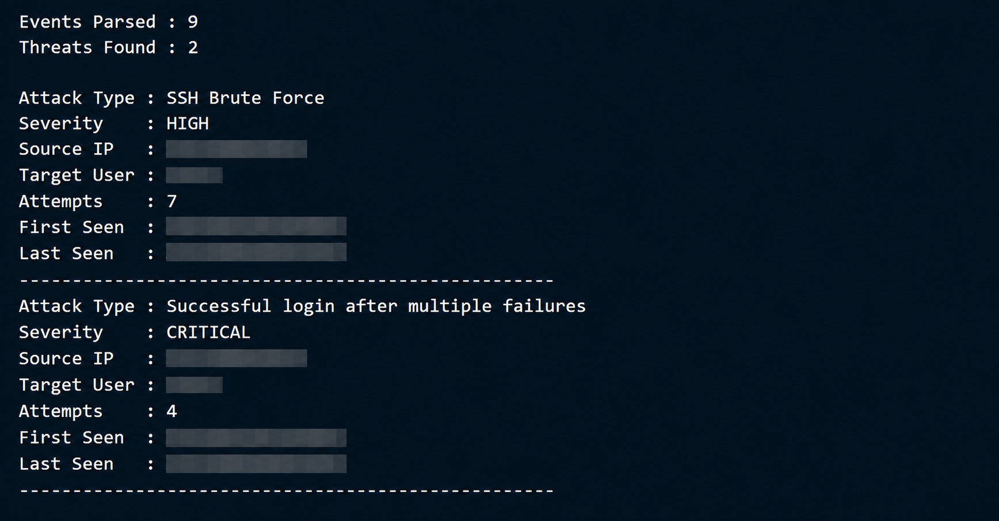

<p align="center">
  
</p>

<h1 align="center">🛡️ AegisLog</h1>

<p align="center">
  <b>Transforming Authentication Logs into Actionable Security Intelligence</b>
</p>

<p align="center">
  A Python-based Security Log Investigation & Detection Engine built for Blue Teamers, SOC Analysts, DFIR Practitioners, and Cybersecurity Learners.
</p>

<p align="center">


</p>

---

# 📖 About AegisLog

Modern systems generate large volumes of authentication events.

Hidden among normal activity may be:

- Failed login attempts
- SSH brute-force attacks
- Username enumeration
- Password spraying
- Unauthorized access attempts
- Successful logins following repeated failures

Manually reviewing authentication logs for these patterns can be slow and error-prone.

**AegisLog** automates this process by parsing authentication logs, converting raw events into structured data, correlating related activity, and applying detection rules to identify suspicious behavior.

The goal is not simply to make logs easier to read — it is to transform raw authentication activity into useful security findings.

---

# 🚀 Why AegisLog?

After completing **Nexorium Pulse**, a multithreaded TCP port scanner, I wanted to expand from offensive-security fundamentals into practical **Blue Team and SOC engineering**.

AegisLog focuses on skills commonly used during security monitoring and investigation:

- Authentication Log Analysis
- Detection Engineering
- Event Correlation
- Threat Classification
- IP Enrichment
- Real-Time Monitoring
- Security Reporting
- Incident Investigation

The project is built incrementally with modular Python components, testing, documentation, and real authentication-log validation.

---

# ✨ Current Features

### Log Processing

- ✅ Linux OpenSSH authentication log parsing
- ✅ Windows Security Event Log monitoring
- ✅ Windows Event ID `4624` support
- ✅ Windows Event ID `4625` support
- ✅ File-based authentication log analysis
- ✅ Real-time Linux authentication monitoring
- ✅ Real-time Windows authentication monitoring
- ✅ Structured `AuthEvent` data model
- ✅ Source IP extraction
- ✅ Source IP classification
- ✅ Username extraction
- ✅ Authentication status extraction
- ✅ SSH service and connection information extraction
- ✅ Invalid-user identification
- ✅ Unsupported-event filtering
- ✅ File input validation and error handling

### Detection Engine

- ✅ Authentication Brute Force Detection
- ✅ Username Enumeration Detection
- ✅ Password Spraying Detection
- ✅ Successful Login After Multiple Failures Detection
- ✅ Severity Classification
- ✅ Source IP and account-based event grouping
- ✅ Structured `ThreatFinding` results
- ✅ Shared detection engine for Linux and Windows events

### Real-Time Monitoring

- ✅ Linux authentication log monitoring
- ✅ Windows Security Event Log monitoring
- ✅ New-event detection
- ✅ Existing-event filtering at monitor startup
- ✅ Live security alerts
- ✅ Real-time threat correlation

### Reporting

- ✅ Structured threat findings
- ✅ Human-readable security reports
- ✅ Threat severity summaries
- ✅ Source IP information
- ✅ Target account information
- ✅ First/last seen timestamps
- ✅ Security recommendations

### Testing

- ✅ Synthetic authentication event testing
- ✅ Real OpenSSH authentication log testing
- ✅ Kali Linux systemd journal validation
- ✅ Windows authentication event testing
- ✅ Safe Windows brute-force detection test
- ✅ Cross-platform detection workflow

---

# 🔎 Current Detection Rules

| Detection | Description | Severity |
|---|---|---|
| Authentication Brute Force | Repeated failed authentication attempts against the same account | HIGH |
| Username Enumeration | Multiple invalid usernames attempted from the same source | MEDIUM |
| Password Spraying | One source attempts authentication against multiple accounts | HIGH |
| Successful Login After Failures | Successful authentication following repeated failures | CRITICAL |

The detection engine is shared between Linux and Windows authentication events.

---

# 🌐 Supported Platforms

| Platform | Log Source | Analysis | Real-Time |
|---|---|---:|---:|
| Linux | OpenSSH Authentication Logs | ✅ | ✅ |
| Windows | Security Event Log | ✅ | ✅ |

### Windows Events

AegisLog currently monitors:

```text
4624 - Successful Logon
4625 - Failed Logon
```

Windows events are normalized into the same `AuthEvent` model used by Linux authentication events.

---

# 🏗 System Architecture

```text
                    AEGISLOG
                        |
            +-----------+-----------+
            |                       |
          Linux                   Windows
            |                       |
       Authentication          Security Event
           Logs                     Log
            |                       |
        parser.py             windows_parser.py
            |                       |
            +-----------+-----------+
                        |
                     AuthEvent
                        |
                  LiveDetector
                        |
                Detection Engine
                        |
                  ThreatFinding
                        |
                  IP Enrichment
                        |
                 Security Alert
                        |
                 Report Generator
                        |
              Investigation Report
```

AegisLog separates log ingestion, event normalization, detection, enrichment, and reporting so additional log sources and detection rules can be introduced without redesigning the entire application.

---

# 🧩 Authentication Event Model

Linux and Windows authentication events are normalized into the same `AuthEvent` structure.

```text
AuthEvent
|
+-- timestamp
+-- hostname
+-- service
+-- pid
+-- status
+-- username
+-- source_ip
+-- source_port
+-- protocol
+-- invalid_user
+-- raw_log
```

This allows authentication events from different operating systems to pass through the same detection pipeline.

---

# 🚀 Usage

## Analyze an Authentication Log

```powershell
python src/main.py sample_logs/linux_auth.log
```

You can also provide another supported OpenSSH authentication log:

```powershell
python src/main.py path/to/authentication.log
```

AegisLog will:

1. Validate the supplied file.
2. Parse supported authentication events.
3. Convert them into structured events.
4. Run the available detection rules.
5. Classify source information.
6. Generate security findings.
7. Generate an investigation report.

Example:

```text
Events Parsed : 18
Threats Found : 4

Attack Type : Authentication Brute Force
Severity    : HIGH

Attack Type : Username Enumeration
Severity    : MEDIUM

Attack Type : Successful Login After Multiple Failures
Severity    : CRITICAL

Attack Type : Password Spraying
Severity    : HIGH
```

---

# 🖥️ Linux Real-Time Monitoring

Start the Linux live monitor:

```powershell
python src/monitor.py
```

The monitor watches for new authentication events and sends them through the live detection engine.

Example:

```text
==================================================
             AEGISLOG LIVE MONITOR
==================================================

[Aug 09 16:10:01] FAILED   kali            192.168.19.1
[Aug 09 16:10:05] FAILED   kali            192.168.19.1
[Aug 09 16:10:09] FAILED   kali            192.168.19.1
[Aug 09 16:10:13] FAILED   kali            192.168.19.1
[Aug 09 16:10:17] FAILED   kali            192.168.19.1

!!!!!!!!!!!!!!!!!!!!!!!!!!!!!!!!!!!!!!!!!!!!!!!!!!
AEGISLOG SECURITY ALERT
!!!!!!!!!!!!!!!!!!!!!!!!!!!!!!!!!!!!!!!!!!!!!!!!!!
Attack Type : Authentication Brute Force
Severity    : HIGH
Source IP   : 192.168.19.1
Target User : kali
Attempts    : 5
First Seen  : Aug 09 16:10:01
Last Seen   : Aug 09 16:10:17

Recommendation
Investigate source IP immediately.
!!!!!!!!!!!!!!!!!!!!!!!!!!!!!!!!!!!!!!!!!!!!!!!!!!
```

---

# 🪟 Windows Real-Time Monitoring

Windows Security Event Log monitoring requires appropriate privileges.

Run the terminal as Administrator and start:

```powershell
python src/windows_monitor.py
```

AegisLog starts monitoring from the current Security Event record.

Example:

```text
============================================================
          AEGISLOG WINDOWS LIVE MONITOR
============================================================
Log        : Security
Status     : ACTIVE
Events     : 4624, 4625
Detection  : ENABLED
Press Ctrl+C to stop.
============================================================

Starting after event record: XXXXX

Waiting for NEW authentication events...
```

Previously existing events are ignored.

Only authentication events generated after the monitor starts are processed.

Example:

```text
------------------------------------------------------------
WINDOWS SUCCESSFUL AUTHENTICATION
------------------------------------------------------------
Username    : USERNAME
Source IP   : local
Status      : SUCCESS
Event ID    : 4624
Record      : XXXXX
------------------------------------------------------------
```

Sensitive usernames, IP addresses, and system information should be removed before publishing screenshots or logs.

---

# 🔐 IP Classification

AegisLog classifies authentication source addresses to provide additional investigation context.

Supported classifications include:

```text
Local
Loopback
Private
Public
Reserved
Documentation
Unknown
```

Example:

```text
Source IP : 192.168.1.50
IP Type   : Private
```

For local authentication:

```text
Source IP : local
IP Type   : Local
```

Windows authentication events may not always provide a remote source IP depending on the authentication type and system configuration.

---

# 🚨 Security Alerts

When suspicious activity is detected, AegisLog generates a structured security alert.

Example:

```text
==================================================
        AEGISLOG SECURITY ALERT
==================================================

Attack Type : Authentication Brute Force
Severity    : HIGH
Source IP   : 192.168.1.50
Target User : TEST_USER
Attempts    : 5
First Seen  : Aug 09 16:10:01
Last Seen   : Aug 09 16:10:17

Recommendation
Investigate source IP immediately.

==================================================
```

---

# 📄 Reports

AegisLog generates human-readable investigation reports.

Example:

```text
Generated on : Aug 09 2026 15:33:54
Log File     : linux_auth.log

ANALYSIS SUMMARY

Events Parsed : 18
Threats Found : 4

THREAT SEVERITY

Critical : 1
High     : 2
Medium   : 1
Low      : 0
```

Reports contain:

- Analysis summary
- Threat count
- Severity classification
- Attack type
- Source IP
- IP classification
- Target account
- Attempt count
- First seen timestamp
- Last seen timestamp
- Security recommendation

Generated local reports are excluded from Git where appropriate.

---

# 🧪 Testing

AegisLog includes automated regression tests covering the backend detection, parsing, correlation, and event-processing behavior.

Run the complete test suite:

python -m pytest -v

Current verification:

66 passed
0 failed

The PySide6 GUI has been integrated without modifying the core backend detection and correlation logic.

AegisLog includes a safe Windows detection test that does not require intentionally failing a real Windows account.

Run:

```powershell
python tests/test_windows_detection.py
```

The test generates simulated Windows authentication events and sends them through the actual `LiveDetector`.

Example:

```text
============================================================
       AEGISLOG WINDOWS DETECTION TEST
============================================================

Attempt 1
Attempt 2
Attempt 3
Attempt 4
Attempt 5

Attack Type : Authentication Brute Force
Severity    : HIGH
Attempts    : 5
```

This provides a safe way to validate Windows detection logic without generating repeated failed logins against a real user account.

---

# 🧪 Real-World Testing

AegisLog has been tested against authentication events generated by a real **OpenSSH server running on Kali Linux** inside an isolated virtual-machine environment.

Controlled authentication activity was generated and recorded by the Kali Linux `systemd` journal.

The journal was exported and analyzed directly by AegisLog.

Testing successfully verified:

- Genuine OpenSSH authentication parsing
- Failed authentication detection
- Successful authentication detection
- Repeated authentication failure detection
- Successful login following multiple failures
- Invalid username detection
- Multiple-account authentication activity
- Source IP extraction
- Real-time Linux monitoring
- Security report generation

Windows monitoring has also been tested against the Windows Security Event Log.

Windows testing successfully verified:

- Security Event Log access
- New-event monitoring
- Event ID `4624`
- Event ID `4625`
- Username extraction
- Local authentication handling
- Loopback authentication handling
- Source IP extraction when available
- Windows event normalization
- Integration with the shared `LiveDetector`

Sensitive environment-specific information is excluded from public documentation and screenshots.

---

# 📸 Screenshots

## Project Logo

<p align="center">
  
</p>

## Real OpenSSH Detection

The following output was produced while analyzing authentication events generated by a real OpenSSH server in the controlled Kali Linux test environment.

<p align="center">
  
</p>

Sensitive environment-specific information has been redacted from public screenshots.

---

# 📚 Documentation

AegisLog is documented alongside development rather than documenting the project only after completion.

Current documentation includes:

- ✅ Architecture
- ✅ Development Roadmap
- ✅ Supported Log Format
- ✅ Detection Engine
- ✅ Real-World Testing
- ✅ Windows Monitoring

Additional documentation planned as development continues:

- Advanced Event Correlation
- JSON Reports
- HTML Investigation Reports
- Investigation Timeline
- GUI Design
- Expanded Automated Testing
- Changelog

Documentation is available inside:

```text
docs/
```

---

# 📂 Project Structure

```text
AegisLog
│
├── assets/
│   ├── banner/
│   ├── icons/
│   └── logo/
│
├── docs/
│   ├── ARCHITECTURE.md
│   ├── ROADMAP.md
│   ├── LOG_FORMAT.md
│   ├── DETECTION_ENGINE.md
│   └── TESTING.md
│
├── reports/
│
├── sample_logs/
│   └── linux_auth.log
│
├── screenshots/
│   └── linux-real-log-detection.png
│
├── src/
│   ├── main.py
│   ├── parser.py
│   ├── detector.py
│   ├── live_detector.py
│   ├── monitor.py
│   ├── windows_monitor.py
│   ├── windows_parser.py
│   ├── models.py
│   ├── report_generator.py
│   └── utils.py
│
├── tests/
│   └── test_windows_detection.py
│
├── .gitignore
├── README.md
├── LICENSE
└── requirements.txt
```

---

# ⚙️ Installation

## Requirements

- Python 3.11+
- Windows or Linux
- Administrator privileges for Windows Security Event Log monitoring

External dependencies:

```text
portalocker==4.1.0
pywin32==312
```

## Clone the Repository

```bash
git clone https://github.com/daniyal-sec/AegisLog.git
cd AegisLog
```

## Create a Virtual Environment

Windows:

```powershell
python -m venv .venv
```

Activate it:

```powershell
.venv\Scripts\Activate.ps1
```

Install dependencies:

```powershell
python -m pip install -r requirements.txt
```

The `.venv/` directory is intentionally excluded from Git.

---

# 🔐 Security & Privacy

Authentication logs may contain sensitive information including:

- Usernames
- Internal IP addresses
- Hostnames
- Authentication timestamps
- Infrastructure information

Real authentication logs used during development should not be committed to the public repository.

Only synthetic or sanitized sample logs should be committed.

Do not commit:

- Passwords
- API keys
- Authentication tokens
- Private credentials
- Sensitive Windows event data
- Personal authentication logs
- Local Python environments

The following is intentionally excluded from Git:

```text
.venv/
```

Generated reports and local testing logs are also excluded where appropriate.

Only monitor systems and accounts for which you have appropriate authorization.

---

# 🗺 Development Roadmap

## Phase 1 — Foundation ✅

- ✅ Repository Setup
- ✅ Branding
- ✅ Initial Documentation
- ✅ Project Architecture

## Phase 2 — Detection Engine ✅

- ✅ Authentication Log Parser
- ✅ AuthEvent Model
- ✅ Authentication Brute Force Detection
- ✅ Username Enumeration Detection
- ✅ Successful Login After Multiple Failures
- ✅ Password Spraying Detection
- ✅ File Input Handling
- ✅ Real Linux Authentication Log Testing
- ✅ Detection Severity Classification
- ✅ Source IP Classification

## Phase 3 — Platform & Real-Time Monitoring ✅

- ✅ Linux Real-Time Monitoring
- ✅ Windows Event Log Support
- ✅ Windows Event ID `4624`
- ✅ Windows Event ID `4625`
- ✅ Windows Event Parsing
- ✅ Shared Cross-Platform Detection Pipeline
- ✅ Real-Time Security Alerts
- ✅ Investigation Report Generation
- 🚧 Advanced Event Correlation
- 🚧 Additional Detection Rules

## Phase 4 — Investigation & Reporting 🚧

- 🚧 Investigation Timeline
- 🚧 JSON Reports
- 🚧 HTML Investigation Reports
- 🚧 Advanced Correlation
- 🚧 Configurable Detection Thresholds

## Phase 5 — Application 🚧

- 🚧 Desktop GUI
- 🚧 Detection Dashboard
- 🚧 Investigation Workflow
- 🚧 Performance Optimization
- 🚧 Expanded Testing
- 🚧 Release Preparation

---

# 🎯 Long-Term Vision

AegisLog is designed to evolve beyond a simple authentication log parser.

The long-term objective is to create a lightweight Blue Team investigation platform capable of:

- Multi-source Authentication Log Analysis
- Detection Engineering
- Event Correlation
- Threat Classification
- IP Enrichment
- Real-Time Monitoring
- Investigation Timeline Generation
- Security Report Generation
- Windows and Linux Log Analysis
- Interactive Desktop Investigation Dashboard

---

# ⚠️ Project Status

AegisLog has reached a functional **cross-platform monitoring MVP**.

The current implementation supports:

- Linux authentication analysis
- Linux real-time monitoring
- Windows Security Event monitoring
- Windows `4624` / `4625` processing
- Shared cross-platform detection
- Authentication threat detection
- IP classification
- Real-time security alerts
- Investigation reports
- Automated Windows detection testing

The project remains under active development.

Detection behavior, supported log formats, architecture, and command-line interfaces may change as development progresses.

AegisLog should currently be considered an educational and investigation-support tool rather than a replacement for production SIEM, EDR, XDR, or enterprise security-monitoring platforms.

---

# 🤝 Contributing

Suggestions, improvements, and constructive feedback are welcome.

You can:

- Open an Issue
- Submit a Pull Request
- Suggest new detection rules
- Report parser compatibility issues
- Improve documentation
- Contribute sanitized test cases

---

# 📄 License

This project is licensed under the MIT License.

---

<p align="center">

<b>Built for the Cybersecurity Community</b>

<br>

Analyze • Detect • Correlate • Investigate

<br><br>

⭐ If you find AegisLog useful, consider giving the project a star.

</p>